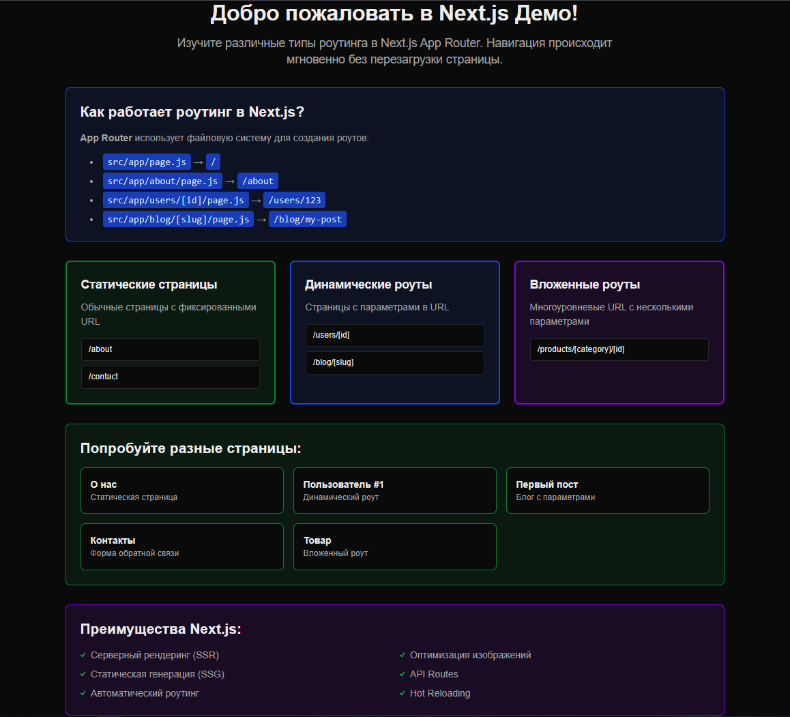

# 🚀 Next.js Демо - Изучение роутинга

[](https://nextjs.org/)
[](https://reactjs.org/)
[](https://tailwindcss.com/)
[](LICENSE)
[](https://github.com/features/actions)

Интерактивная демонстрация различных типов роутинга в Next.js App Router с современным UI/UX дизайном и поддержкой светлой/тёмной темы.



## 📋 Содержание

-   [✨ Особенности](#-особенности)
-   [🚀 Быстрый старт](#-быстрый-старт)
-   [📁 Структура проекта](#-структура-проекта)
-   [🎯 Типы роутинга](#-типы-роутинга)
-   [🎨 UI/UX особенности](#-uiux-особенности)
-   [🛠 Технологии](#-технологии)
-   [📦 Установка и запуск](#-установка-и-запуск)
-   [🧪 Тестирование](#-тестирование)
-   [🚀 Деплой](#-деплой)
-   [🤝 Вклад в проект](#-вклад-в-проект)
-   [📄 Лицензия](#-лицензия)

## ✨ Особенности

-   **🎯 Интерактивная демонстрация** всех типов роутинга Next.js
-   **🌙 Поддержка тёмной темы** с автоматическим переключением
-   **📱 Адаптивный дизайн** для всех устройств
-   **⚡ Серверный рендеринг (SSR)** для лучшей производительности
-   **🔍 SEO оптимизация** с автоматическими метаданными
-   **🎨 Современный UI** с Tailwind CSS
-   **📝 Подробная документация** для каждого типа роута
-   **🔄 Hot Reloading** для быстрой разработки

## 🚀 Быстрый старт

```bash
# Клонирование репозитория
git clone https://github.com/FrankFMY/learn-nextjs-from-scratch.git
cd learn-nextjs-from-scratch

# Установка зависимостей
npm install

# Запуск в режиме разработки
npm run dev

# Открыть в браузере
open http://localhost:3000
```

## 📁 Структура проекта

```
nextjs-app/
├── src/
│   ├── app/
│   │   ├── about/                 # Статические страницы
│   │   │   └── page.js
│   │   ├── contact/               # Клиентские компоненты
│   │   │   └── page.js
│   │   ├── users/
│   │   │   └── [id]/              # Динамические роуты
│   │   │       └── page.js
│   │   ├── blog/
│   │   │   └── [slug]/            # Динамические роуты
│   │   │       └── page.js
│   │   ├── products/
│   │   │   └── [category]/
│   │   │       └── [id]/          # Вложенные роуты
│   │   │           └── page.js
│   │   ├── globals.css            # Глобальные стили
│   │   ├── layout.js              # Корневой layout
│   │   └── page.js                # Главная страница
│   └── components/
│       └── Navigation.js          # Компонент навигации
├── public/                        # Статические файлы
├── .github/                       # CI/CD конфигурация
├── README.md
├── LICENSE
└── package.json
```

## 🎯 Типы роутинга

### 1. **Статические страницы** (`/about`, `/contact`)

-   Генерируются на этапе сборки
-   Максимальная производительность
-   Отлично для SEO
-   Кэшируются CDN

### 2. **Динамические роуты** (`/users/[id]`, `/blog/[slug]`)

-   Параметры из URL
-   Серверный рендеринг
-   Поддержка `generateStaticParams`
-   Персональный контент

### 3. **Вложенные роуты** (`/products/[category]/[id]`)

-   Многоуровневые URL
-   Несколько параметров
-   Сложная структура данных
-   Иерархическая навигация

## 🎨 UI/UX особенности

### 🌙 Тёмная тема

-   Автоматическое переключение по системным настройкам
-   CSS переменные для консистентности
-   Плавные переходы между темами
-   Оптимизированные цвета для контраста

### 📱 Адаптивность

-   Mobile-first подход
-   Responsive grid система
-   Оптимизированная навигация
-   Touch-friendly интерфейс

### 🎯 Доступность

-   Семантическая разметка
-   ARIA атрибуты
-   Контрастные цвета
-   Клавиатурная навигация

## 🛠 Технологии

-   **[Next.js 14](https://nextjs.org/)** - React фреймворк с App Router
-   **[React 18](https://reactjs.org/)** - UI библиотека
-   **[Tailwind CSS](https://tailwindcss.com/)** - Utility-first CSS фреймворк
-   **[PostCSS](https://postcss.org/)** - CSS обработчик
-   **[ESLint](https://eslint.org/)** - Линтер JavaScript
-   **[GitHub Actions](https://github.com/features/actions)** - CI/CD

## 📦 Установка и запуск

### Предварительные требования

-   Node.js 18.0.0 или выше
-   npm 9.0.0 или выше

### Установка

```bash
# Клонирование
git clone https://github.com/FrankFMY/learn-nextjs-from-scratch.git
cd learn-nextjs-from-scratch

# Установка зависимостей
npm install
```

### Разработка

```bash
# Запуск dev сервера
npm run dev

# Сборка для продакшена
npm run build

# Запуск продакшен сборки
npm start

# Линтинг
npm run lint
```

### Переменные окружения

Создайте файл `.env.local`:

```env
# Опционально: настройки для продакшена
NEXT_PUBLIC_APP_NAME="Next.js Демо"
NEXT_PUBLIC_APP_URL="http://localhost:3000"
```

## 🧪 Тестирование

```bash
# Запуск тестов
npm test

# Запуск тестов в watch режиме
npm run test:watch

# Покрытие кода тестами
npm run test:coverage
```

## 🚀 Деплой

### Vercel (рекомендуется)

[](https://vercel.com/new/clone?repository-url=https://github.com/FrankFMY/learn-nextjs-from-scratch)

```bash
# Установка Vercel CLI
npm i -g vercel

# Деплой
vercel
```

### Netlify

```bash
# Сборка
npm run build

# Деплой
netlify deploy --prod --dir=out
```

### Docker

```dockerfile
FROM node:18-alpine

WORKDIR /app
COPY package*.json ./
RUN npm ci --only=production

COPY . .
RUN npm run build

EXPOSE 3000
CMD ["npm", "start"]
```

## 🤝 Вклад в проект

Мы приветствуем вклады! Пожалуйста, ознакомьтесь с нашими [правилами контрибьюции](CONTRIBUTING.md).

### Как внести вклад

1. Форкните репозиторий
2. Создайте ветку для новой функции (`git checkout -b feature/amazing-feature`)
3. Зафиксируйте изменения (`git commit -m 'Add amazing feature'`)
4. Отправьте в ветку (`git push origin feature/amazing-feature`)
5. Откройте Pull Request

### Правила кода

-   Следуйте [Conventional Commits](https://www.conventionalcommits.org/)
-   Используйте ESLint и Prettier
-   Пишите тесты для новой функциональности
-   Обновляйте документацию при необходимости

## 📄 Лицензия

Этот проект лицензирован под MIT License - см. файл [LICENSE](LICENSE) для деталей.

## 🙏 Благодарности

-   [Next.js Team](https://nextjs.org/) за отличный фреймворк
-   [Tailwind CSS](https://tailwindcss.com/) за прекрасные стили
-   [Vercel](https://vercel.com/) за хостинг и деплой
-   Всем контрибьюторам проекта

## 📞 Поддержка

Если у вас есть вопросы или предложения:

-   📧 Email: [pryanishnikovartem@gmail.com]
-   🐛 Issues: [GitHub Issues](https://github.com/FrankFMY/learn-nextjs-from-scratch/issues)
-   💬 Discussions: [GitHub Discussions](https://github.com/FrankFMY/learn-nextjs-from-scratch/discussions)

---

⭐ Если этот проект вам помог, поставьте звезду на GitHub!

